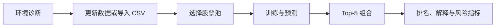

# Quintara

<p align="center">
  <strong>在本机完成 A 股数据管理、模型训练与下一周 Top-5 组合研究</strong>
</p>

<p align="center">
  中文桌面应用 · Windows / Linux · 本地运行 · 零遥测
</p>

<p align="center">
  <a href="https://github.com/Telecaster2147/quintara/actions/workflows/ci.yml"></a>
  <a href="https://github.com/Telecaster2147/quintara/actions/workflows/package.yml"></a>
  <a href="LICENSE"></a>
  
  
</p>

Quintara 把数据更新、CSV 检查、股票池管理、环境诊断、训练、预测和结果解释整合到一个
独立桌面应用中。日常操作都在应用内完成，不必在浏览器和命令行之间切换。

> [!IMPORTANT]
> Quintara 是本地研究工具，输出为模型推荐组合与预测排名，不代表收益承诺或交易指令。

## Windows 安装

发布安装包已经包含 Python、Qt、LightGBM 和应用运行环境，Windows 用户无需另行安装
Python、Git 或开发工具。

### 1. 下载安装包

从 [Quintara Releases](https://github.com/Telecaster2147/quintara/releases/latest) 下载最新正式版。
发布页会同时提供两种 Windows 版本：

| 版本 | 适合场景 | 下载 |
| --- | --- | --- |
| 安装版 | 正常安装，可创建开始菜单和桌面快捷方式 | [下载 Windows 安装程序](https://github.com/Telecaster2147/quintara/releases/latest/download/Quintara-Windows-x64-Setup.exe) |
| 便携版 | 无需安装，在下载位置直接运行 | [下载 Windows 便携版](https://github.com/Telecaster2147/quintara/releases/latest/download/Quintara-Windows-x64-Portable.exe) |

上述链接始终指向最新正式版，不需要查找 Actions 构建记录或解压 Artifact。

### 2. 完成安装

安装向导可创建开始菜单和桌面快捷方式。安装包目前未使用数字签名，
Windows SmartScreen 可能显示发布者提示。请核对下载地址与构建来源，然后在“更多信息”中继续安装。

### 3. 首次启动

从桌面或开始菜单打开 **Quintara**，依次完成：

1. 阅读并确认本地研究声明；
2. 查看系统、CPU、内存、磁盘和 NVIDIA 环境诊断；
3. 更新 BaoStock 数据，或导入自己的 CSV；
4. 选择 PIT 基准股票池或自定义股票池；
5. 选择训练年限与策略，开始训练并查看 Top-5 结果。

安装器本身不携带历史行情。行情由用户首次启动时直接从 BaoStock 下载到自己的电脑。

## 使用流程



### 使用 Quintara 管理的数据

在“数据”页面点击更新后，Quintara 会登录 BaoStock，拉取行情和 extra features，完成校验，
再发布新的不可变数据版本。下载中断或校验失败时，当前有效版本保持原状。

### 使用自己的 CSV

导入前会检查编码、字段、代码、日期、重复键、OHLC、数值范围、历史长度和单位声明。
Quintara 保留源文件，不替用户修改或填补原始数据；检查结果会给出中文说明和问题样本。

字段定义、单位及模板说明见 [`docs/CSV_FIELD_DICTIONARY.md`](docs/CSV_FIELD_DICTIONARY.md)。

### 管理自定义股票池

“股票池”页面支持：

- 输入单只或多只股票代码；
- 从 CSV 批量追加代码；
- 通过 BaoStock 搜索代码或名称后添加；
- 查看当前股票清单；
- 从当前股票池删除代码；
- 创建并保存多个命名股票池。

自定义池至少包含 100 只沪、深、北交易所 A 股普通股。自定义静态股票池的结果会明确提示
幸存者偏差，其模型和结果与 PIT 路线相互隔离。命名股票池的激活切换也可通过 CLI 完成。

### 查看结果

结果首页展示：

- 模型推荐的五只股票；
- 固定组合权重 `40% / 25% / 15% / 12% / 8%`；
- 数据截止日和下一实际交易周；
- 股票池路线和数据新鲜度；
- 清晰的入选解释。

高级详情还包含完整排名、模型分数、主要特征贡献、20/60/120 日风险指标、相关性和来源信息。
每次结果都与数据版本、股票池、模型配置和运行环境 identity 绑定，便于复查和复现。

## 数据路线

| 路线 | 适合场景 | Quintara 的处理方式 |
| --- | --- | --- |
| `PIT_BASELINE` | 按历史时点研究沪深 300 | 使用经过校验的历史成员有效区间 |
| `CUSTOM_UNIVERSE` | 研究用户定义的 A 股池 | 使用独立静态池，显著标记幸存者偏差 |
| `NON_PIT_FALLBACK` | 使用当前成分回看历史 | 仅在用户显式确认后建立，并永久显示提示 |

BaoStock 的单次成分查询是指定日期的快照。进入 `PIT_BASELINE` 时，成员数据需要包含
`stock_id,index_code,start_date,end_date` 有效区间。完整决策见
[`docs/ADR-001-PIT-AND-BAOSTOCK.md`](docs/ADR-001-PIT-AND-BAOSTOCK.md)。

## 策略与计算口径

- 默认预测标签：`close(T+5) / open(T+1) - 1`，只按实际交易日计数；
- 训练年限：3–10 年；
- 策略选择：`aggressive`、`balanced`、`conservative`；
- 组合权重保持固定，策略主要调整模型容量与正则；
- CPU 是权威结果路径；NVIDIA GPU 在诊断通过后作为实验加速路径。

## Linux 安装

Linux 发布包支持 Ubuntu 22.04/24.04 与 Debian 12/13 x86-64。下载
[Linux x86-64 最新正式版](https://github.com/Telecaster2147/quintara/releases/latest/download/Quintara-Linux-x86_64.tar.gz)
并运行：

```bash
tar -xzf Quintara-Linux-x86_64.tar.gz
chmod +x Quintara
./Quintara --version
./Quintara gui
```

如果希望安装到当前用户的 `$HOME/.local`，在源码目录构建 bundle 后运行：

```bash
uv sync --locked --all-groups
uv run python packaging/build_release.py
./packaging/install_linux.sh
```

## 命令行使用

无桌面 Linux、自动化和排错场景可以使用 CLI。GUI 与 CLI 共用同一套数据、训练和结果逻辑。

```bash
# 环境诊断
quintara doctor

# 更新数据
quintara data update --start-date 2015-01-01 --pit-membership-csv ./pit_membership.csv

# 显式建立当前快照研究路线
quintara data update --allow-non-pit

# 训练并输出结果
quintara run --strategy balanced --years 5

# 查看运行历史和结果
quintara runs
quintara results RUN_ID --details
```

自定义股票池也可以通过 CLI 编辑：

```bash
quintara universe list
quintara universe add CUSTOM_UNIVERSE_ID 600000,000001
quintara universe remove CUSTOM_UNIVERSE_ID codes.csv
```

## 数据保存在哪里

| 系统 | 默认位置 |
| --- | --- |
| Windows | `%LOCALAPPDATA%\Quintara` |
| Linux | `~/.local/share/quintara` |

主要目录：

```text
data/generations/       不可变数据版本
universes/              股票池定义
models/                 模型文件
results/RUN_ID/         组合、完整排名、解释和 provenance
registry.sqlite3        本地运行索引
diagnostics/            用户主动导出的脱敏诊断包
```

卸载应用时默认保留这些用户数据，重新安装后可继续使用。

## 隐私与联网

- 永久关闭自动遥测、崩溃上传和使用统计；
- 环境信息、日志、股票池、模型和结果只保存在本机；
- 用户点击数据更新时连接 BaoStock；
- 用户启用版本检查后，只请求 GitHub Releases 的版本信息；
- 诊断包由用户主动生成并保存在本地，默认排除原始行情。

详情见 [`docs/PRIVACY.md`](docs/PRIVACY.md)。

## 从源码运行

面向开发者的源码环境需要 Python 3.12 和 [`uv`](https://docs.astral.sh/uv/)：

```bash
git clone git@github.com:Telecaster2147/quintara.git
cd quintara
uv sync --locked --all-groups
uv run quintara doctor
uv run quintara gui
```

运行质量门：

```bash
uv run ruff check src tests packaging
uv run python packaging/typecheck.py
uv run pytest
cd docs/openspec/openspec && openspec validate --strict --all
```

## 文档导航

| 文档 | 内容 |
| --- | --- |
| [`docs/FIRST_USE.md`](docs/FIRST_USE.md) | 首次启动与完整操作流程 |
| [`docs/CSV_FIELD_DICTIONARY.md`](docs/CSV_FIELD_DICTIONARY.md) | CSV 字段、单位和验证规则 |
| [`docs/OPERATIONS.md`](docs/OPERATIONS.md) | 数据恢复、运行维护和排错 |
| [`docs/ERROR_CATALOG.md`](docs/ERROR_CATALOG.md) | 中文错误索引与处理建议 |
| [`docs/PRODUCT_DESIGN.md`](docs/PRODUCT_DESIGN.md) | 产品架构和设计决策 |
| [`docs/openspec/README.md`](docs/openspec/README.md) | OpenSpec 需求、设计、任务与追溯 |
| [`docs/RELEASE.md`](docs/RELEASE.md) | 发布门禁与验证证据 |

## 贡献

Issue 和 Pull Request 均可用于提交问题、体验反馈和功能改进。开发约定见
[`CONTRIBUTING.md`](CONTRIBUTING.md)。

## 许可证

Quintara 使用 [MIT License](LICENSE)。第三方组件、许可证与数据来源说明见
[`docs/THIRD_PARTY_NOTICES.md`](docs/THIRD_PARTY_NOTICES.md)。
